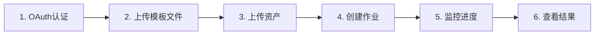

# Gmail邮件助手 API 使用文档（AI Agent专用）

> **文档版本**: v2.1
> **最后更新**: 2025年10月
> **目标读者**: AI Agent / 自动化系统

## 📋 目录

1. [快速概览](#快速概览)
2. [认证机制](#认证机制)
3. [API端点分类](#api端点分类)
4. [推荐工作流程](#推荐工作流程)
5. [API详细说明](#api详细说明)
6. [错误处理](#错误处理)
7. [限制与约束](#限制与约束)
8. [示例场景](#示例场景)

---

## 快速概览

### 核心能力

- ✅ Gmail API集成，支持OAuth认证
- ✅ 多语言模板系统（英语、西语等）
- ✅ 内联图片支持（HTML邮件中的图片）
- ✅ 文件附件支持（PDF、DOC、Excel等）
- ✅ 异步作业调度，支持定时发送
- ✅ 实时作业控制（暂停/恢复/取消）
- ✅ 事件流追踪，支持Webhook通知

### 服务器地址

```
默认地址: http://127.0.0.1:5000
生产环境: 根据实际部署配置
```

---

## 认证机制

### API密钥认证

所有写操作（POST/PUT/DELETE）需要在HTTP Header中提供API密钥:

```http
X-API-Key: your_api_key_here
```

**需要API密钥的操作:**
- 发送邮件
- 上传模板/资产
- 控制作业状态
- 删除资源

**无需API密钥的操作:**
- 健康检查
- 查询作业状态
- 获取模板列表
- 获取资产列表

### Gmail OAuth认证

发件人邮箱需要通过OAuth2.0进行授权:

**方式1: Web OAuth流程（推荐）**

```http
GET /oauth/google/authorize?sender_email={email}&master_user_id={mu}&store_id={store}&return_url={url}
```

系统会重定向到Google授权页面，授权完成后回调到指定URL。

---

## API端点分类

### 1. 基础服务

| 端点 | 方法 | 说明 | 需要密钥 |
|------|------|------|----------|
| `/api/health` | GET | 健康检查 | ❌ |
| `/api/db/health` | GET | 数据库健康检查 | ❌ |

### 2. 作业管理（推荐使用）

| 端点 | 方法 | 说明 | 需要密钥 |
|------|------|------|----------|
| `/api/jobs/send_template_emails` | POST | 使用模板发送邮件（推荐） | ✅ |
| `/api/jobs/send_emails` | POST | 使用自定义内容发送邮件 | ✅ |
| `/api/jobs/{job_id}` | GET | 获取作业信息 | ❌ |
| `/api/jobs/{job_id}/events` | GET | 获取作业事件流 | ❌ |
| `/api/jobs/{job_id}/pause` | POST | 暂停作业 | ✅ |
| `/api/jobs/{job_id}/resume` | POST | 恢复作业 | ✅ |
| `/api/jobs/{job_id}/cancel` | POST | 取消作业 | ✅ |

### 3. 模板管理

| 端点 | 方法 | 说明 | 需要密钥 |
|------|------|------|----------|
| `/api/template_files` | POST | 上传模板文件 | ✅ |
| `/api/template_files` | GET | 列出模板语言 | ❌ |
| `/api/template_files/{language}` | GET | 获取特定语言模板 | ❌ |
| `/api/template_files/all` | GET | 批量获取所有语言模板内容 | ❌ |
| `/api/template_files/{language}` | DELETE | 删除模板 | ✅ |

### 4. 资产管理（图片/附件）

| 端点 | 方法 | 说明 | 需要密钥 |
|------|------|------|----------|
| `/api/assets` | POST | 上传资产文件 | ✅ |
| `/api/assets` | GET | 列出资产 | ❌ |
| `/api/assets/{asset_id}` | GET | 获取资产详情 | ❌ |
| `/api/assets/{asset_id}` | DELETE | 删除资产 | ✅ |

### 6. 文件浏览（pics/attachments）

#### GET /api/files/{kind}

列出指定租户 `pics` 或 `attachments` 目录下的所有文件。

**路径参数**:
- `kind`: `pics` 或 `attachments`

**查询参数**:
- `master_user_id` (string, 必填)
- `store_id` (string, 必填)

**响应示例**:
```json
{
  "success": true,
  "kind": "pics",
  "items": [
    { "name": "logo.png", "size_bytes": 45678, "mtime": "2025-10-25T20:10:00", "mime_type": "image/png" },
    { "name": "banner.jpg", "size_bytes": 123456, "mtime": "2025-10-25T20:12:34", "mime_type": "image/jpeg" }
  ]
}
```

#### GET /api/files/{kind}/{filename}

预览或下载指定文件（支持图片在线预览，附件下载）。

**路径参数**:
- `kind`: `pics` 或 `attachments`
- `filename`: 文件名（例如 `logo.png`, `brochure.pdf`）

**查询参数**:
- `master_user_id` (string, 必填)
- `store_id` (string, 必填)
- `download` (boolean, 可选) 为 `true` 时强制下载

**示例**:
```bash
# 在线预览图片（浏览器将根据 Content-Type 渲染）
curl "http://127.0.0.1:5000/api/files/pics/logo.png?master_user_id=admin&store_id=store" -o -

# 下载附件（触发附件下载）
curl -L "http://127.0.0.1:5000/api/files/attachments/brochure.pdf?master_user_id=admin&store_id=store&download=true" -o brochure.pdf
```

### 5. 发件人管理

| 端点 | 方法 | 说明 | 需要密钥 |
|------|------|------|----------|
| `/api/senders` | GET | 列出发件人账号 | ❌ |
| `/api/senders/{sender_id}` | DELETE | 解绑发件人账号 | ✅ |

---

## 推荐工作流程

### 标准发送流程（使用模板）



### 详细步骤

#### Step 1: OAuth认证（首次使用）

```http
GET /oauth/google/authorize?sender_email=your@gmail.com&master_user_id=1&store_id=2&return_url=https://your-app.com/callback
```

**重要**: 授权完成后，系统会自动保存token，后续无需重复认证。

#### Step 2: 上传模板文件

上传主题模板:

```bash
curl -X POST http://127.0.0.1:5000/api/template_files \
  -H "X-API-Key: your_api_key" \
  -F "master_user_id=1" \
  -F "store_id=2" \
  -F "language=en" \
  -F "kind=subject" \
  -F "file=@en_subject.txt"
```

上传内容模板:

```bash
curl -X POST http://127.0.0.1:5000/api/template_files \
  -H "X-API-Key: your_api_key" \
  -F "master_user_id=1" \
  -F "store_id=2" \
  -F "language=en" \
  -F "kind=content" \
  -F "file=@en_content.html"
```

**模板文件格式**:

主题模板 (en_subject.txt):
```
Loved your [video_topic] video and a partnership idea!
```

内容模板 (en_content.html):
```html
<p>Hi [name],</p>
<p>[hook]</p>
<div style="text-align: center;">
    
</div>
<p>Best regards,<br>Your Team</p>
```

#### Step 3: 上传资产（图片/附件）

上传Logo图片:

```bash
curl -X POST http://127.0.0.1:5000/api/assets \
  -H "X-API-Key: your_api_key" \
  -F "master_user_id=1" \
  -F "store_id=2" \
  -F "asset_type=image" \
  -F "file_id=logo" \
  -F "file=@logo.png"
```

上传PDF附件:

```bash
curl -X POST http://127.0.0.1:5000/api/assets \
  -H "X-API-Key: your_api_key" \
  -F "master_user_id=1" \
  -F "store_id=2" \
  -F "asset_type=attachment" \
  -F "file_id=product_catalog" \
  -F "file=@catalog.pdf"
```

#### Step 4: 创建发送作业

```bash
curl -X POST http://127.0.0.1:5000/api/jobs/send_template_emails \
  -H "X-API-Key: your_api_key" \
  -H "Content-Type: application/json" \
  -d '{
    "master_user_id": "1",
    "store_id": "2",
    "sender_email": "your@gmail.com",
    "attachments": ["product_catalog"],
    "recipients": [
      {
        "to_email": "customer1@example.com",
        "language": "en",
        "variables": {
          "name": "John",
          "video_topic": "camping",
          "hook": "Loved your recent video!"
        }
      },
      {
        "to_email": "customer2@example.com",
        "language": "en",
        "variables": {
          "name": "Jane",
          "video_topic": "hiking",
          "hook": "Your content is amazing!"
        }
      }
    ],
    "min_interval": 20,
    "max_interval": 90,
    "start_time": "2025-10-17T14:00:00+08:00"
  }'
```

**响应示例**:

```json
{
  "success": true,
  "job_id": "202510171230_abc123",
  "recipients": 2,
  "queued": true,
  "schedule_at": "2025-10-17 06:00:00.000000"
}
```

#### Step 5: 监控作业进度

查询作业信息:

```bash
curl http://127.0.0.1:5000/api/jobs/202510171230_abc123
```

**响应示例**:

```json
{
  "success": true,
  "job": {
    "id": "202510171230_abc123",
    "status": "running",
    "job_type": "template",
    "sender_email": "your@gmail.com",
    "created_at": "2025-10-17T12:30:00",
    "schedule_at": "2025-10-17T14:00:00"
  },
  "recipients": 2
}
```

查询事件流:

```bash
curl http://127.0.0.1:5000/api/jobs/202510171230_abc123/events
```

**响应示例**:

```json
{
  "success": true,
  "events": [
    {
      "event_type": "started",
      "timestamp": "2025-10-17T14:00:01",
      "details": {}
    },
    {
      "event_type": "recipient_success",
      "timestamp": "2025-10-17T14:00:15",
      "details": {
        "to_email": "customer1@example.com",
        "message_id": "18bcd1234567890"
      }
    },
    {
      "event_type": "recipient_success",
      "timestamp": "2025-10-17T14:01:02",
      "details": {
        "to_email": "customer2@example.com",
        "message_id": "18bcd0987654321"
      }
    },
    {
      "event_type": "completed",
      "timestamp": "2025-10-17T14:01:05",
      "details": {
        "total": 2,
        "success": 2,
        "failed": 0
      }
    }
  ]
}
```

#### Step 6: 作业控制（可选）

暂停作业:

```bash
curl -X POST http://127.0.0.1:5000/api/jobs/202510171230_abc123/pause \
  -H "X-API-Key: your_api_key"
```

恢复作业:

```bash
curl -X POST http://127.0.0.1:5000/api/jobs/202510171230_abc123/resume \
  -H "X-API-Key: your_api_key"
```

取消作业:

```bash
curl -X POST http://127.0.0.1:5000/api/jobs/202510171230_abc123/cancel \
  -H "X-API-Key: your_api_key"
```

---

## API详细说明

### 作业发送API

#### POST /api/jobs/send_template_emails

使用模板发送邮件（推荐）。

**请求参数**:

| 参数 | 类型 | 必需 | 说明 |
|------|------|------|------|
| `master_user_id` | string | ✅ | 主用户ID |
| `store_id` | string | ✅ | 店铺ID |
| `sender_email` | string | ✅ | 发件人邮箱(必须已OAuth认证） |
| `recipients` | array | ✅ | 收件人列表 |
| `attachments` | array | ❌ | 附件文件ID列表 |
| `template_id` | integer | ❌ | 模板ID（使用数据库模板时） |
| `min_interval` | integer | ❌ | 最小发送间隔秒数（默认20） |
| `max_interval` | integer | ❌ | 最大发送间隔秒数（默认90） |
| `start_time` | string | ❌ | 计划开始时间（ISO格式，支持时区） |
| `webhook_url` | string | ❌ | 事件通知Webhook地址 |

**recipients数组元素**:

| 字段 | 类型 | 必需 | 说明 |
|------|------|------|------|
| `to_email` | string | ✅ | 收件人邮箱地址 |
| `language` | string | ✅ | 语言代码（如: en, esp, fr） |
| `variables` | object | ❌ | 模板变量键值对 |

**模板变量替换规则**:

- 模板中使用 `[变量名]` 格式的占位符
- `variables` 对象中的键值对会替换对应占位符
- HTML模板中的 `` 会自动关联图片资产

**请求示例**:

```json
{
  "master_user_id": "1",
  "store_id": "2",
  "sender_email": "marketing@company.com",
  "attachments": ["product_catalog", "price_list"],
  "recipients": [
    {
      "to_email": "client@example.com",
      "language": "en",
      "variables": {
        "name": "John Doe",
        "company": "ACME Corp",
        "video_topic": "Product Demo"
      }
    }
  ],
  "min_interval": 30,
  "max_interval": 60,
  "start_time": "2025-10-17T15:00:00+08:00",
  "webhook_url": "https://your-app.com/webhooks/email-events"
}
```

**响应示例**:

```json
{
  "success": true,
  "job_id": "202510171400_xyz789",
  "recipients": 1,
  "queued": true,
  "schedule_at": "2025-10-17 07:00:00.000000"
}
```

**注意事项**:

1. **语言回退**: 如果指定语言的模板不存在，系统会自动回退到英语（en）
2. **图片处理**: 系统会自动扫描HTML模板中的 `` 并转换为 `cid:image_xxx`
3. **附件路径**: `attachments` 参数可以是file_id或文件名，系统会自动解析路径
4. **时区处理**: `start_time` 如果包含时区信息会自动转换为UTC
5. **变量缺失**: 如果模板中的变量在 `variables` 中不存在，占位符将保持原样

---

#### POST /api/jobs/send_emails

使用自定义内容发送邮件。

**请求参数**:

| 参数 | 类型 | 必需 | 说明 |
|------|------|------|------|
| `master_user_id` | string | ✅ | 主用户ID |
| `store_id` | string | ✅ | 店铺ID |
| `sender_email` | string | ✅ | 发件人邮箱 |
| `subject` | string | ✅ | 邮件主题 |
| `content` | string | ✅ | 纯文本内容 |
| `html_content` | string | ❌ | HTML内容（推荐） |
| `recipients` | array | ✅ | 收件人列表 |
| `attachments` | array | ❌ | 附件文件ID列表 |
| `min_interval` | integer | ❌ | 最小间隔秒数（默认20） |
| `max_interval` | integer | ❌ | 最大间隔秒数（默认90） |
| `start_time` | string | ❌ | 开始时间（ISO格式） |
| `webhook_url` | string | ❌ | Webhook地址 |

**请求示例**:

```json
{
  "master_user_id": "1",
  "store_id": "2",
  "sender_email": "sales@company.com",
  "subject": "Special Offer Just for You",
  "content": "Hello, we have a special offer...",
  "html_content": "<p>Hello,</p><p>We have a <strong>special offer</strong>...</p>",
  "recipients": [
    {
      "to_email": "customer@example.com",
      "variables": {}
    }
  ],
  "attachments": ["brochure"],
  "min_interval": 20,
  "max_interval": 90
}
```

**注意**: 此接口不使用模板系统，内容固定。适合发送统一的营销邮件。

---

### 模板文件API

#### POST /api/template_files

上传模板文件（multipart/form-data）。

**表单字段**:

| 字段 | 类型 | 必需 | 说明 |
|------|------|------|------|
| `master_user_id` | string | ✅ | 主用户ID |
| `store_id` | string | ✅ | 店铺ID |
| `language` | string | ✅ | 语言代码（en/esp/fr，或 `default`） |
| `kind` | string | ✅ | 模板类型: subject 或 content |
| `file` | file | ✅ | 模板文件 |

**命名规范**:

系统会自动保存为: `files/tenant_{mu}_{store}/templates/{language}_{kind}.txt`

**示例**:

```bash
# 上传英语主题模板
curl -X POST http://127.0.0.1:5000/api/template_files \
  -H "X-API-Key: your_key" \
  -F "master_user_id=1" \
  -F "store_id=2" \
  -F "language=en" \
  -F "kind=subject" \
  -F "file=@subject_en.txt"

# 上传西语内容模板
curl -X POST http://127.0.0.1:5000/api/template_files \
  -H "X-API-Key: your_key" \
  -F "master_user_id=1" \
  -F "store_id=2" \
  -F "language=esp" \
  -F "kind=content" \
  -F "file=@content_esp.html"
```

---

#### GET /api/template_files

列出已上传的模板语言。

**查询参数**:

| 参数 | 类型 | 必需 | 说明 |
|------|------|------|------|
| `master_user_id` | string | ✅ | 主用户ID |
| `store_id` | string | ✅ | 店铺ID |

**响应示例**:

```json
{
  "success": true,
  "items": [
    {
      "language": "en",
      "has_subject": true,
      "has_content": true,
      "subject_path": "files/tenant_1_2/templates/en_subject.txt",
      "content_path": "files/tenant_1_2/templates/en_content.txt"
    },
    {
      "language": "esp",
      "has_subject": true,
      "has_content": true,
      "subject_path": "files/tenant_1_2/templates/esp_subject.txt",
      "content_path": "files/tenant_1_2/templates/esp_content.txt"
    }
  ]
}
```

---

#### GET /api/template_files/all

批量获取指定租户的所有语言模板内容（subject 与 content）。

**查询参数**:

| 参数 | 类型 | 必需 | 说明 |
|------|------|------|------|
| `master_user_id` | string | ✅ | 主用户ID |
| `store_id` | string | ✅ | 店铺ID |
| `include_empty` | boolean | ❌ | 是否包含subject与content均为空的语言（默认 false） |

**示例**:

```bash
# 获取所有语言模板内容（默认不包含空模板）
curl "http://127.0.0.1:5000/api/template_files/all?master_user_id=1&store_id=2"

# 包含空模板语言
curl "http://127.0.0.1:5000/api/template_files/all?master_user_id=1&store_id=2&include_empty=true"
```

**响应示例**:

```json
{
  "success": true,
  "items": [
    {
      "language": "en",
      "subject": "Loved your [video_topic] video!",
      "content": "<p>Hi [name],</p><p>[hook]</p>..."
    },
    {
      "language": "esp",
      "subject": "¡Nos encantó tu video de [video_topic]!",
      "content": "<p>Hola [name],</p><p>[hook]</p>..."
    }
  ]
}
```

---

#### GET /api/template_files/{language}

获取特定语言的模板内容。

**路径参数**: `language` - 语言代码

**查询参数**:

| 参数 | 类型 | 必需 | 说明 |
|------|------|------|------|
| `master_user_id` | string | ✅ | 主用户ID |
| `store_id` | string | ✅ | 店铺ID |

**响应示例**:

```json
{
  "success": true,
  "template": {
    "language": "en",
    "subject": "Loved your [video_topic] video!",
    "content": "<p>Hi [name],</p><p>[hook]</p>..."
  }
}
```

---

#### DELETE /api/template_files/{language}

删除模板文件。

**路径参数**: `language` - 语言代码

**查询参数**:

| 参数 | 类型 | 必需 | 说明 |
|------|------|------|------|
| `master_user_id` | string | ✅ | 主用户ID |
| `store_id` | string | ✅ | 店铺ID |
| `kind` | string | ❌ | subject/content/不传则删除两者 |

---

### 资产管理API

#### POST /api/assets

上传资产文件（图片或附件）。

**表单字段**:

| 字段 | 类型 | 必需 | 说明 |
|------|------|------|------|
| `master_user_id` | string | ✅ | 主用户ID |
| `store_id` | string | ✅ | 店铺ID |
| `asset_type` | string | ✅ | image 或 attachment |
| `file_id` | string | ❌ | 文件ID（默认使用文件名） |
| `file` | file | ✅ | 文件 |

**支持的文件格式**:

图片 (asset_type=image):
- JPG/JPEG
- PNG
- GIF
- BMP
- WebP

附件 (asset_type=attachment):
- PDF, DOC, DOCX
- XLS, XLSX
- PPT, PPTX
- TXT, CSV, RTF
- ZIP, RAR, 7Z

**文件大小限制**: 单个文件最大25MB

**示例**:

```bash
# 上传Logo图片
curl -X POST http://127.0.0.1:5000/api/assets \
  -H "X-API-Key: your_key" \
  -F "master_user_id=1" \
  -F "store_id=2" \
  -F "asset_type=image" \
  -F "file_id=logo" \
  -F "file=@company_logo.png"

# 上传PDF附件
curl -X POST http://127.0.0.1:5000/api/assets \
  -H "X-API-Key: your_key" \
  -F "master_user_id=1" \
  -F "store_id=2" \
  -F "asset_type=attachment" \
  -F "file_id=catalog" \
  -F "file=@product_catalog.pdf"
```

**响应示例**:

```json
{
  "success": true,
  "file_id": "logo",
  "path": "files/tenant_1_2/pics/company_logo.png"
}
```

---

#### GET /api/assets

列出资产文件。

**查询参数**:

| 参数 | 类型 | 必需 | 说明 |
|------|------|------|------|
| `master_user_id` | string | ✅ | 主用户ID |
| `store_id` | string | ✅ | 店铺ID |
| `asset_type` | string | ❌ | 过滤类型: image/attachment |
| `limit` | integer | ❌ | 返回数量（默认50） |
| `offset` | integer | ❌ | 偏移量（默认0） |

**响应示例**:

```json
{
  "success": true,
  "items": [
    {
      "id": 1,
      "asset_type": "image",
      "file_id": "logo",
      "filename": "company_logo.png",
      "mime_type": "image/png",
      "size_bytes": 45678,
      "storage_path": "files/tenant_1_2/pics/company_logo.png",
      "created_at": "2025-10-17T10:00:00"
    },
    {
      "id": 2,
      "asset_type": "attachment",
      "file_id": "catalog",
      "filename": "product_catalog.pdf",
      "mime_type": "application/pdf",
      "size_bytes": 1234567,
      "storage_path": "files/tenant_1_2/attachments/product_catalog.pdf",
      "created_at": "2025-10-17T10:05:00"
    }
  ]
}
```

---

### 作业控制API

#### GET /api/jobs/{job_id}

获取作业详细信息。

**响应示例**:

```json
{
  "success": true,
  "job": {
    "id": "202510171400_xyz789",
    "master_user_id": 1,
    "store_id": 2,
    "status": "running",
    "job_type": "template",
    "sender_email": "marketing@company.com",
    "template_id": null,
    "subject": null,
    "content": null,
    "html_content": null,
    "min_interval": 30,
    "max_interval": 60,
    "webhook_url": "https://your-app.com/webhooks",
    "schedule_at": "2025-10-17 07:00:00.000000",
    "created_at": "2025-10-17 06:50:00.000000",
    "updated_at": "2025-10-17 07:01:30.000000"
  },
  "recipients": 50
}
```

**作业状态说明**:

| 状态 | 说明 |
|------|------|
| `pending` | 等待开始 |
| `running` | 正在发送 |
| `paused` | 已暂停 |
| `completed` | 已完成 |
| `stopped` | 已取消 |
| `failed` | 失败 |

---

#### GET /api/jobs/{job_id}/events

获取作业事件流。

**响应示例**:

```json
{
  "success": true,
  "events": [
    {
      "id": 1,
      "job_id": "202510171400_xyz789",
      "event_type": "started",
      "event_data": "{}",
      "created_at": "2025-10-17T07:00:01"
    },
    {
      "id": 2,
      "job_id": "202510171400_xyz789",
      "event_type": "recipient_success",
      "event_data": "{\"to_email\":\"client@example.com\",\"message_id\":\"18bcd1234567890\"}",
      "created_at": "2025-10-17T07:00:25"
    },
    {
      "id": 3,
      "job_id": "202510171400_xyz789",
      "event_type": "recipient_failed",
      "event_data": "{\"to_email\":\"invalid@example.com\",\"error\":\"Invalid email address\"}",
      "created_at": "2025-10-17T07:01:10"
    },
    {
      "id": 4,
      "job_id": "202510171400_xyz789",
      "event_type": "completed",
      "event_data": "{\"total\":50,\"success\":49,\"failed\":1}",
      "created_at": "2025-10-17T07:45:00"
    }
  ]
}
```

**事件类型说明**:

| 事件类型 | 说明 | event_data内容 |
|---------|------|---------------|
| `started` | 作业开始 | `{}` |
| `recipient_success` | 单个收件人发送成功 | `{to_email, message_id}` |
| `recipient_failed` | 单个收件人发送失败 | `{to_email, error}` |
| `paused` | 作业被暂停 | `{}` |
| `resumed` | 作业恢复 | `{}` |
| `completed` | 作业完成 | `{total, success, failed}` |
| `failed` | 作业失败 | `{error}` |

---

#### POST /api/jobs/{job_id}/pause

暂停正在运行的作业。

**响应**:

```json
{
  "success": true
}
```

---

#### POST /api/jobs/{job_id}/resume

恢复已暂停的作业。

**响应**:

```json
{
  "success": true
}
```

---

#### POST /api/jobs/{job_id}/cancel

取消作业（停止发送）。

**响应**:

```json
{
  "success": true
}
```

**注意**: 取消后的作业无法恢复。

---

### OAuth认证API

#### GET /oauth/google/authorize

发起Gmail OAuth认证流程。

**查询参数**:

| 参数 | 类型 | 必需 | 说明 |
|------|------|------|------|
| `sender_email` | string | ✅ | 要认证的Gmail邮箱 |
| `master_user_id` | string | ❌ | 主用户ID（推荐提供） |
| `store_id` | string | ❌ | 店铺ID（推荐提供） |
| `return_url` | string | ❌ | 认证完成后的跳转地址 |

**流程**:

1. 用户访问此URL
2. 系统重定向到Google OAuth页面
3. 用户授权Gmail访问权限
4. Google回调到 `/oauth/google/callback`
5. 系统保存token并重定向到 `return_url`

**示例**:

```
https://your-server.com/oauth/google/authorize?sender_email=marketing@company.com&master_user_id=1&store_id=2&return_url=https://your-app.com/settings/email
```

**回调参数**:

成功: `?success=1&email=marketing@company.com`
失败: `?success=0&error=error_message`

---

## 错误处理

### 标准错误响应格式

所有API错误均返回以下格式:

```json
{
  "success": false,
  "error": "错误描述信息"
}
```

### HTTP状态码

| 状态码 | 说明 | 场景 |
|--------|------|------|
| 200 | 成功 | 请求正常处理 |
| 400 | 请求错误 | 参数缺失或格式错误 |
| 401 | 未授权 | API密钥错误或缺失 |
| 404 | 资源不存在 | job_id/asset_id等不存在 |
| 409 | 冲突 | 已有作业在运行 |
| 500 | 服务器错误 | 系统内部错误 |

### 常见错误及处理

#### 1. 认证错误

**错误**: `"Unauthorized"`
**原因**: API密钥错误或未提供
**解决**: 在HTTP Header中添加正确的 `X-API-Key`

#### 2. 参数错误

**错误**: `"missing {参数名}"`
**原因**: 必需参数未提供
**解决**: 检查请求体，补充缺失参数

#### 3. 发件人未授权

**错误**: `"Sender email not authenticated"`
**原因**: 发件人邮箱未完成OAuth认证
**解决**: 先调用 `/oauth/google/authorize` 完成认证

#### 4. 模板不存在

**错误**: `"Template not found for language: {lang}"`
**原因**: 指定语言的模板文件不存在
**解决**: 上传对应语言的模板文件，或使用英语（en）作为回退

#### 5. 资产不存在

**错误**: `"Asset not found: {file_id}"`
**原因**: 附件或图片资产未上传
**解决**: 先调用 `/api/assets` 上传资产文件

#### 6. 作业冲突

**错误**: `"A task is already running"`
**原因**: 当前有其他作业正在执行（V1 API限制）
**解决**: 使用V2 API（支持并发作业）

#### 7. 时间格式错误

**错误**: `"Invalid start_time (ISO format)"`
**原因**: `start_time` 参数格式不正确
**解决**: 使用ISO 8601格式，如 `2025-10-17T14:00:00+08:00`

### 错误处理最佳实践

#### AI Agent应实现的逻辑:

```python
def send_email_with_retry(job_data, max_retries=3):
    """发送邮件并处理错误"""

    for attempt in range(max_retries):
        response = requests.post(
            "http://127.0.0.1:5000/api/jobs/send_template_emails",
            headers={"X-API-Key": API_KEY},
            json=job_data
        )

        if response.status_code == 200:
            return response.json()

        error_data = response.json()
        error_msg = error_data.get("error", "")

        # 根据错误类型处理
        if response.status_code == 401:
            # 认证错误，无需重试
            raise Exception("API Key错误")

        elif response.status_code == 400:
            if "missing" in error_msg:
                # 参数错误，修正后重试
                job_data = fix_missing_params(job_data, error_msg)
                continue
            elif "Template not found" in error_msg:
                # 模板不存在，回退到英语
                job_data["recipients"] = [
                    {**r, "language": "en"}
                    for r in job_data["recipients"]
                ]
                continue
            else:
                raise Exception(f"参数错误: {error_msg}")

        elif response.status_code == 404:
            if "Asset not found" in error_msg:
                # 资产不存在，移除附件后重试
                job_data.pop("attachments", None)
                continue
            else:
                raise Exception(f"资源不存在: {error_msg}")

        elif response.status_code == 500:
            # 服务器错误，等待后重试
            time.sleep(2 ** attempt)
            continue

        else:
            raise Exception(f"未知错误: {error_msg}")

    raise Exception("重试次数超限")
```

---

## 限制与约束

### 1. Gmail API限制

| 项目 | 限制 |
|------|------|
| 每日发送量 | 约2000封/天（Google Workspace可能更高） |
| 每分钟发送 | 建议不超过30封 |
| 单封邮件大小 | 最大25MB（含附件） |
| 收件人数量 | 建议每封邮件1个收件人 |

**建议**: 设置 `min_interval=20, max_interval=90` 来遵守速率限制

### 2. 文件大小限制

| 类型 | 限制 |
|------|------|
| 单个图片 | 最大25MB |
| 单个附件 | 最大25MB |
| 总附件大小 | 最大25MB |
| 模板文件 | 建议不超过1MB |

### 3. 并发限制

| API版本 | 并发作业 |
|---------|---------|
| V1 API | 同时仅支持1个作业 |
| V2 API | 支持多个并发作业 |

**建议**: 优先使用V2 API

### 4. 数据库存储

| 项目 | 限制/建议 |
|------|----------|
| 作业事件保留 | 建议定期清理（30天） |
| 模板数量 | 无硬性限制 |
| 资产数量 | 建议定期清理未使用资产 |

### 5. 变量替换限制

- 变量名最长64字符
- 变量值最长10000字符
- 单个模板最多支持100个变量
- 变量名只能包含字母、数字、下划线、中文

### 6. 语言支持

当前推荐的语言代码:

| 代码 | 语言 |
|------|------|
| `en` | English（英语，默认回退语言） |
| `esp` | Spanish（西班牙语） |
| `fr` | French（法语） |
| `de` | German（德语） |
| `zh` | Chinese（中文） |
| `ja` | Japanese（日语） |

**自定义语言**: 可以使用任意语言代码，只需上传对应的模板文件

---

## 示例场景

### 场景1: 批量营销邮件发送

**需求**: 向1000个客户发送个性化营销邮件，包含公司Logo和产品目录PDF

**步骤**:

1. **准备资源**:
   - 上传Logo: `logo.png`
   - 上传目录: `catalog.pdf`
   - 上传模板: 英语主题和内容

2. **创建作业**:

```json
{
  "master_user_id": 1,
  "store_id": 2,
  "sender_email": "marketing@company.com",
  "attachments": ["catalog"],
  "recipients": [
    {
      "to_email": "customer1@example.com",
      "language": "en",
      "variables": {
        "name": "John",
        "company": "ACME Corp"
      }
    },
    // ... 999 more recipients
  ],
  "min_interval": 30,
  "max_interval": 60,
  "start_time": "2025-10-18T09:00:00+08:00"
}
```

3. **监控进度**:

```python
import time

job_id = response["job_id"]

while True:
    status = requests.get(f"http://127.0.0.1:5000/api/jobs/{job_id}").json()
    if status["job"]["status"] in ["completed", "stopped", "failed"]:
        break
    time.sleep(60)  # 每分钟检查一次

# 获取最终结果
events = requests.get(f"http://127.0.0.1:5000/api/jobs/{job_id}/events").json()
completed_event = [e for e in events["events"] if e["event_type"] == "completed"][0]
print(f"发送完成: {completed_event['event_data']}")
```

---

### 场景2: 多语言客户跟进

**需求**: 向英语和西语客户发送跟进邮件

**步骤**:

1. **上传两种语言模板**:

```bash
# 英语模板
curl -X POST http://127.0.0.1:5000/api/template_files \
  -H "X-API-Key: xxx" \
  -F "master_user_id=1" \
  -F "store_id=2" \
  -F "language=en" \
  -F "kind=subject" \
  -F "file=@en_subject.txt"

curl -X POST http://127.0.0.1:5000/api/template_files \
  -H "X-API-Key: xxx" \
  -F "master_user_id=1" \
  -F "store_id=2" \
  -F "language=en" \
  -F "kind=content" \
  -F "file=@en_content.html"

# 西语模板
curl -X POST http://127.0.0.1:5000/api/template_files \
  -H "X-API-Key: xxx" \
  -F "master_user_id=1" \
  -F "store_id=2" \
  -F "language=esp" \
  -F "kind=subject" \
  -F "file=@esp_subject.txt"

curl -X POST http://127.0.0.1:5000/api/template_files \
  -H "X-API-Key: xxx" \
  -F "master_user_id=1" \
  -F "store_id=2" \
  -F "language=esp" \
  -F "kind=content" \
  -F "file=@esp_content.html"
```

2. **发送混合语言作业**:

```json
{
  "master_user_id": 1,
  "store_id": 2,
  "sender_email": "support@company.com",
  "recipients": [
    {
      "to_email": "john@example.com",
      "language": "en",
      "variables": {"name": "John"}
    },
    {
      "to_email": "maria@ejemplo.com",
      "language": "esp",
      "variables": {"name": "María"}
    }
  ],
  "min_interval": 20,
  "max_interval": 90
}
```

系统会自动为每个收件人选择对应语言的模板。

---

### 场景3: 定时发送与进度通知

**需求**: 在特定时间发送邮件，并通过Webhook接收进度通知

**步骤**:

1. **创建带Webhook的作业**:

```json
{
  "master_user_id": 1,
  "store_id": 2,
  "sender_email": "newsletter@company.com",
  "recipients": [...],
  "start_time": "2025-10-18T08:00:00+08:00",
  "webhook_url": "https://your-app.com/api/email-webhook"
}
```

2. **实现Webhook接收端**:

```python
from flask import Flask, request

app = Flask(__name__)

@app.route("/api/email-webhook", methods=["POST"])
def email_webhook():
    data = request.json
    event_type = data.get("event_type")
    job_id = data.get("job_id")

    if event_type == "started":
        print(f"作业 {job_id} 已开始")
    elif event_type == "recipient_success":
        email = data["event_data"]["to_email"]
        print(f"邮件发送成功: {email}")
    elif event_type == "completed":
        stats = data["event_data"]
        print(f"作业完成: 总数{stats['total']}, 成功{stats['success']}, 失败{stats['failed']}")

    return {"success": True}
```

---

### 场景4: 错误恢复与重试

**需求**: 部分收件人发送失败时，自动重试失败项

**实现**:

```python
def send_with_retry(recipients, max_attempts=3):
    """发送邮件并重试失败项"""

    current_recipients = recipients.copy()
    attempt = 0

    while current_recipients and attempt < max_attempts:
        attempt += 1

        # 创建作业
        response = requests.post(
            "http://127.0.0.1:5000/api/jobs/send_template_emails",
            headers={"X-API-Key": API_KEY},
            json={
                "master_user_id": 1,
                "store_id": 2,
                "sender_email": "retry@company.com",
                "recipients": current_recipients,
                "min_interval": 30,
                "max_interval": 60
            }
        )

        job_id = response.json()["job_id"]

        # 等待作业完成
        wait_for_completion(job_id)

        # 获取失败项
        events = requests.get(f"http://127.0.0.1:5000/api/jobs/{job_id}/events").json()
        failed_emails = [
            e["event_data"]["to_email"]
            for e in events["events"]
            if e["event_type"] == "recipient_failed"
        ]

        if not failed_emails:
            print("全部发送成功")
            break

        # 准备重试
        current_recipients = [
            r for r in current_recipients
            if r["to_email"] in failed_emails
        ]

        print(f"第{attempt}次尝试，{len(failed_emails)}个失败，准备重试...")

    if current_recipients:
        print(f"警告: {len(current_recipients)}个收件人在{max_attempts}次尝试后仍失败")

def wait_for_completion(job_id):
    """等待作业完成"""
    while True:
        status = requests.get(f"http://127.0.0.1:5000/api/jobs/{job_id}").json()
        if status["job"]["status"] in ["completed", "stopped", "failed"]:
            return
        time.sleep(10)
```

---

## Webhook 事件示例

当创建作业时提供 `webhook_url`，服务端会在关键事件发生时向该地址发送 `POST application/json` 回调，通用格式如下：

```json
{
  "job_id": "<作业ID>",
  "event_type": "<事件类型>",
  "event_data": { /* 事件数据 */ },
  "timestamp": "2025-10-17T08:00:00Z"
}
```

- 事件类型：`started`、`recipient_success`、`recipient_failed`、`completed`、`failed`
- 回调为尽力而为（best-effort），失败不影响作业执行、不会自动重试；建议接收端快速返回 2xx，并异步处理。

示例：

1) started（作业开始）

```json
{
  "job_id": "d8dd8ad1-1a9a-4a77-9d60-bb8c0a2f6e7c",
  "event_type": "started",
  "event_data": { "total": 120 },
  "timestamp": "2025-10-17T08:00:00Z"
}
```

2) recipient_success（单个收件人成功）

```json
{
  "job_id": "d8dd8ad1-1a9a-4a77-9d60-bb8c0a2f6e7c",
  "event_type": "recipient_success",
  "event_data": { "to_email": "alice@example.com" },
  "timestamp": "2025-10-17T08:00:05Z"
}
```

3) recipient_failed（单个收件人失败）

```json
{
  "job_id": "d8dd8ad1-1a9a-4a77-9d60-bb8c0a2f6e7c",
  "event_type": "recipient_failed",
  "event_data": { "to_email": "bob@example.com", "error": "Daily sending quota exceeded" },
  "timestamp": "2025-10-17T08:00:06Z"
}
```

4) completed（作业完成）

```json
{
  "job_id": "d8dd8ad1-1a9a-4a77-9d60-bb8c0a2f6e7c",
  "event_type": "completed",
  "event_data": { "total": 120, "success": 118, "failed": 2 },
  "timestamp": "2025-10-17T08:30:00Z"
}
```

5) failed（作业失败）

```json
{
  "job_id": "d8dd8ad1-1a9a-4a77-9d60-bb8c0a2f6e7c",
  "event_type": "failed",
  "event_data": { "error": "Gmail service init failed" },
  "timestamp": "2025-10-17T08:00:00Z"
}
```

接收端（Flask 示例）：

```python
from flask import Flask, request

app = Flask(__name__)

@app.route('/api/email-webhook', methods=['POST'])
def email_webhook():
    payload = request.json or {}
    event_type = payload.get('event_type')
    job_id = payload.get('job_id')
    data = payload.get('event_data') or {}
    # 建议快速返回 2xx，业务处理放到异步任务
    return {"ok": True}
```

---

### 场景5: 动态内容生成

**需求**: 根据收件人属性动态生成邮件内容

**实现**:

```python
def generate_personalized_emails(customers_db):
    """从数据库读取客户信息并生成个性化邮件"""

    recipients = []

    for customer in customers_db:
        # 根据客户属性生成个性化内容
        variables = {
            "name": customer["name"],
            "company": customer["company"],
            "last_purchase": customer["last_purchase_date"],
            "recommended_product": recommend_product(customer),
            "discount_code": generate_discount_code(customer["id"]),
            "account_manager": assign_manager(customer["region"])
        }

        # 根据客户语言偏好选择模板
        language = customer.get("preferred_language", "en")

        recipients.append({
            "to_email": customer["email"],
            "language": language,
            "variables": variables
        })

    # 分批发送（每批100个）
    batch_size = 100
    for i in range(0, len(recipients), batch_size):
        batch = recipients[i:i+batch_size]

        response = requests.post(
            "http://127.0.0.1:5000/api/jobs/send_template_emails",
            headers={"X-API-Key": API_KEY},
            json={
                "master_user_id": 1,
                "store_id": 2,
                "sender_email": "personalized@company.com",
                "recipients": batch,
                "attachments": ["loyalty_program"],
                "min_interval": 30,
                "max_interval": 60
            }
        )

        job_id = response.json()["job_id"]
        print(f"批次 {i//batch_size + 1} 已创建，作业ID: {job_id}")
```

---

## 传统API

### 说明

以下API为V1版本，基于Excel文件模式。**不推荐新项目使用**，但保持兼容以支持现有集成。

### 端点列表

| 端点 | 方法 | 说明 |
|------|------|------|
| `/api/validate_excel` | POST | 验证Excel文件 |
| `/api/preview` | POST | 预览待发送邮箱列表 |
| `/api/send_emails` | POST | 发送邮件（传统模式） |
| `/api/validate_templates` | POST | 验证模板兼容性 |
| `/api/preview_template_emails` | POST | 预览模板邮件 |
| `/api/send_template_emails` | POST | 发送模板邮件 |
| `/api/status` | GET | 获取发送状态 |
| `/api/pause` | POST | 暂停发送 |
| `/api/resume` | POST | 恢复发送 |
| `/api/stop` | POST | 停止发送 |
| `/api/statistics` | POST | 获取统计信息 |

### Excel文件格式要求

必需列:
- `邮箱` - 收件人邮箱地址
- `合作次数` - 数值类型
- `回复次数` - 数值类型
- `跟进次数` - 数值类型
- `跟进方式` - 文本类型
- `是否已邮箱建联` - 状态字段（程序自动更新）
- `语言` - 邮件语言（如English、Spanish）

可选列（根据模板变量）:
- `某条视频内容总结`
- `达人ID`
- `钩子`
- 其他自定义列

### 自动筛选条件

```
邮箱 != NULL
AND 合作次数 == 0
AND 回复次数 == 0
AND 跟进次数 == 1
AND 跟进方式 != "手动"
AND (是否已邮箱建联 IS NULL OR 是否已邮箱建联 == 0)
```

---

## 附录

### A. 完整模板示例

#### 英语主题模板 (en_subject.txt)

```
Loved your [video_topic] video and a partnership idea!
```

#### 英语内容模板 (en_content.html)

```html
<!DOCTYPE html>
<html>
<head>
    <meta charset="UTF-8">
    <style>
        body { font-family: Arial, sans-serif; }
        .header { text-align: center; padding: 20px; }
        .content { padding: 20px; }
        .footer { text-align: center; padding: 10px; font-size: 12px; color: #666; }
    </style>
</head>
<body>
    <div class="header">
        
    </div>

    <div class="content">
        <p>Hi [name],</p>

        <p>[hook]</p>

        <p>I'm reaching out from [company] because we believe your content about [video_topic] aligns perfectly with our brand values.</p>

        <p>We'd love to discuss a potential partnership. Please find our product catalog attached for your review.</p>

        <p>Looking forward to hearing from you!</p>

        <p>Best regards,<br>
        [account_manager]<br>
        [company]</p>
    </div>

    <div class="footer">
        <p>This is an automated email. Please do not reply directly.</p>
    </div>
</body>
</html>
```

#### 西语主题模板 (esp_subject.txt)

```
Me encantó tu video sobre [video_topic] y tengo una idea de colaboración!
```

#### 西语内容模板 (esp_content.html)

```html
<!DOCTYPE html>
<html>
<head>
    <meta charset="UTF-8">
    <style>
        body { font-family: Arial, sans-serif; }
        .header { text-align: center; padding: 20px; }
        .content { padding: 20px; }
        .footer { text-align: center; padding: 10px; font-size: 12px; color: #666; }
    </style>
</head>
<body>
    <div class="header">
        
    </div>

    <div class="content">
        <p>Hola [name],</p>

        <p>[hook]</p>

        <p>Me comunico desde [company] porque creemos que tu contenido sobre [video_topic] se alinea perfectamente con los valores de nuestra marca.</p>

        <p>Nos encantaría discutir una posible colaboración. Adjunto encontrarás nuestro catálogo de productos para tu revisión.</p>

        <p>¡Espero tu respuesta!</p>

        <p>Saludos cordiales,<br>
        [account_manager]<br>
        [company]</p>
    </div>

    <div class="footer">
        <p>Este es un correo automático. Por favor no respondas directamente.</p>
    </div>
</body>
</html>
```

---

### B. Python SDK示例

以下是一个简单的Python SDK封装，方便AI Agent调用:

```python
import requests
import time
from typing import List, Dict, Optional

class EmailAssistantClient:
    """Gmail邮件助手API客户端"""

    def __init__(self, base_url: str, api_key: str):
        self.base_url = base_url.rstrip("/")
        self.api_key = api_key
        self.headers = {"X-API-Key": api_key}

    def health_check(self) -> bool:
        """健康检查"""
        resp = requests.get(f"{self.base_url}/api/health")
        return resp.status_code == 200

    def upload_template(
        self,
        master_user_id: str,
        store_id: str,
        language: str,
        subject_file: str,
        content_file: str
    ) -> Dict:
        """上传模板文件"""

        # 上传主题
        with open(subject_file, "rb") as f:
            resp = requests.post(
                f"{self.base_url}/api/template_files",
                headers=self.headers,
                data={
                    "master_user_id": master_user_id,
                    "store_id": store_id,
                    "language": language,
                    "kind": "subject"
                },
                files={"file": f}
            )
            resp.raise_for_status()

        # 上传内容
        with open(content_file, "rb") as f:
            resp = requests.post(
                f"{self.base_url}/api/template_files",
                headers=self.headers,
                data={
                    "master_user_id": master_user_id,
                    "store_id": store_id,
                    "language": language,
                    "kind": "content"
                },
                files={"file": f}
            )
            resp.raise_for_status()

        return {"success": True, "language": language}

    def upload_asset(
        self,
        master_user_id: str,
        store_id: str,
        asset_type: str,
        file_id: str,
        file_path: str
    ) -> Dict:
        """上传资产文件"""

        with open(file_path, "rb") as f:
            resp = requests.post(
                f"{self.base_url}/api/assets",
                headers=self.headers,
                data={
                    "master_user_id": master_user_id,
                    "store_id": store_id,
                    "asset_type": asset_type,
                    "file_id": file_id
                },
                files={"file": f}
            )
            resp.raise_for_status()
            return resp.json()

    def send_template_emails(
        self,
        master_user_id: str,
        store_id: str,
        sender_email: str,
        recipients: List[Dict],
        attachments: Optional[List[str]] = None,
        min_interval: int = 20,
        max_interval: int = 90,
        start_time: Optional[str] = None,
        webhook_url: Optional[str] = None
    ) -> Dict:
        """发送模板邮件"""

        payload = {
            "master_user_id": master_user_id,
            "store_id": store_id,
            "sender_email": sender_email,
            "recipients": recipients,
            "min_interval": min_interval,
            "max_interval": max_interval
        }

        if attachments:
            payload["attachments"] = attachments
        if start_time:
            payload["start_time"] = start_time
        if webhook_url:
            payload["webhook_url"] = webhook_url

        resp = requests.post(
            f"{self.base_url}/api/jobs/send_template_emails",
            headers={**self.headers, "Content-Type": "application/json"},
            json=payload
        )
        resp.raise_for_status()
        return resp.json()

    def get_job_status(self, job_id: str) -> Dict:
        """获取作业状态"""
        resp = requests.get(f"{self.base_url}/api/jobs/{job_id}")
        resp.raise_for_status()
        return resp.json()

    def get_job_events(self, job_id: str) -> List[Dict]:
        """获取作业事件"""
        resp = requests.get(f"{self.base_url}/api/jobs/{job_id}/events")
        resp.raise_for_status()
        return resp.json()["events"]

    def pause_job(self, job_id: str) -> Dict:
        """暂停作业"""
        resp = requests.post(
            f"{self.base_url}/api/jobs/{job_id}/pause",
            headers=self.headers
        )
        resp.raise_for_status()
        return resp.json()

    def resume_job(self, job_id: str) -> Dict:
        """恢复作业"""
        resp = requests.post(
            f"{self.base_url}/api/jobs/{job_id}/resume",
            headers=self.headers
        )
        resp.raise_for_status()
        return resp.json()

    def cancel_job(self, job_id: str) -> Dict:
        """取消作业"""
        resp = requests.post(
            f"{self.base_url}/api/jobs/{job_id}/cancel",
            headers=self.headers
        )
        resp.raise_for_status()
        return resp.json()

    def wait_for_completion(self, job_id: str, check_interval: int = 10) -> Dict:
        """等待作业完成"""
        while True:
            status = self.get_job_status(job_id)
            job_status = status["job"]["status"]

            if job_status in ["completed", "stopped", "failed"]:
                return status

            time.sleep(check_interval)


# 使用示例
if __name__ == "__main__":
    client = EmailAssistantClient(
        base_url="http://127.0.0.1:5000",
        api_key="your_api_key_here"
    )

    # 1. 健康检查
    assert client.health_check()

    # 2. 上传模板
    client.upload_template(
        master_user_id="1",
        store_id="2",
        language="en",
        subject_file="templates/en_subject.txt",
        content_file="templates/en_content.html"
    )

    # 3. 上传资产
    client.upload_asset(
        master_user_id="1",
        store_id="2",
        asset_type="image",
        file_id="logo",
        file_path="assets/logo.png"
    )

    client.upload_asset(
        master_user_id="1",
        store_id="2",
        asset_type="attachment",
        file_id="catalog",
        file_path="assets/catalog.pdf"
    )

    # 4. 发送邮件
    result = client.send_template_emails(
        master_user_id="1",
        store_id="2",
        sender_email="marketing@company.com",
        recipients=[
            {
                "to_email": "customer@example.com",
                "language": "en",
                "variables": {
                    "name": "John",
                    "video_topic": "camping",
                    "hook": "Love your content!"
                }
            }
        ],
        attachments=["catalog"],
        min_interval=30,
        max_interval=60
    )

    job_id = result["job_id"]
    print(f"作业已创建: {job_id}")

    # 5. 等待完成
    final_status = client.wait_for_completion(job_id)
    print(f"作业完成: {final_status}")

    # 6. 查看事件
    events = client.get_job_events(job_id)
    for event in events:
        print(f"{event['event_type']}: {event['created_at']}")
```

---

### C. 常用语言代码映射

| 语言 | 代码 | 示例模板文件名 |
|------|------|---------------|
| 英语 | `en` | `en_subject.txt`, `en_content.html` |
| 西班牙语 | `esp` | `esp_subject.txt`, `esp_content.html` |
| 法语 | `fr` | `fr_subject.txt`, `fr_content.html` |
| 德语 | `de` | `de_subject.txt`, `de_content.html` |
| 意大利语 | `it` | `it_subject.txt`, `it_content.html` |
| 葡萄牙语 | `pt` | `pt_subject.txt`, `pt_content.html` |
| 中文 | `zh` | `zh_subject.txt`, `zh_content.html` |
| 日语 | `ja` | `ja_subject.txt`, `ja_content.html` |
| 韩语 | `ko` | `ko_subject.txt`, `ko_content.html` |
| 俄语 | `ru` | `ru_subject.txt`, `ru_content.html` |
| 阿拉伯语 | `ar` | `ar_subject.txt`, `ar_content.html` |

---

### D. MIME类型参考

#### 图片格式

| 扩展名 | MIME类型 |
|--------|----------|
| `.jpg`, `.jpeg` | `image/jpeg` |
| `.png` | `image/png` |
| `.gif` | `image/gif` |
| `.bmp` | `image/bmp` |
| `.webp` | `image/webp` |

#### 附件格式

| 扩展名 | MIME类型 |
|--------|----------|
| `.pdf` | `application/pdf` |
| `.doc` | `application/msword` |
| `.docx` | `application/vnd.openxmlformats-officedocument.wordprocessingml.document` |
| `.xls` | `application/vnd.ms-excel` |
| `.xlsx` | `application/vnd.openxmlformats-officedocument.spreadsheetml.sheet` |
| `.ppt` | `application/vnd.ms-powerpoint` |
| `.pptx` | `application/vnd.openxmlformats-officedocument.presentationml.presentation` |
| `.txt` | `text/plain` |
| `.csv` | `text/csv` |
| `.zip` | `application/zip` |
| `.rar` | `application/x-rar-compressed` |
| `.7z` | `application/x-7z-compressed` |

---

## 联系与支持

如有问题或需要技术支持，请查看:

- **项目日志**: 所有日志记录在 `logs/` 目录
- **错误排查**: 查看 `docs/使用说明.md` 的故障排除章节
- **API服务器日志**: 控制台会输出详细的请求日志

---

**文档结束**

> 此文档专为AI Agent设计，包含完整的API说明、错误处理、限制约束和示例代码。
> 建议AI Agent实现以下逻辑:
> 1. 错误重试机制
> 2. 作业状态监控
> 3. 资源预检查（模板/资产是否存在）
> 4. 批量发送优化（分批处理）
> 5. 日志记录与审计
